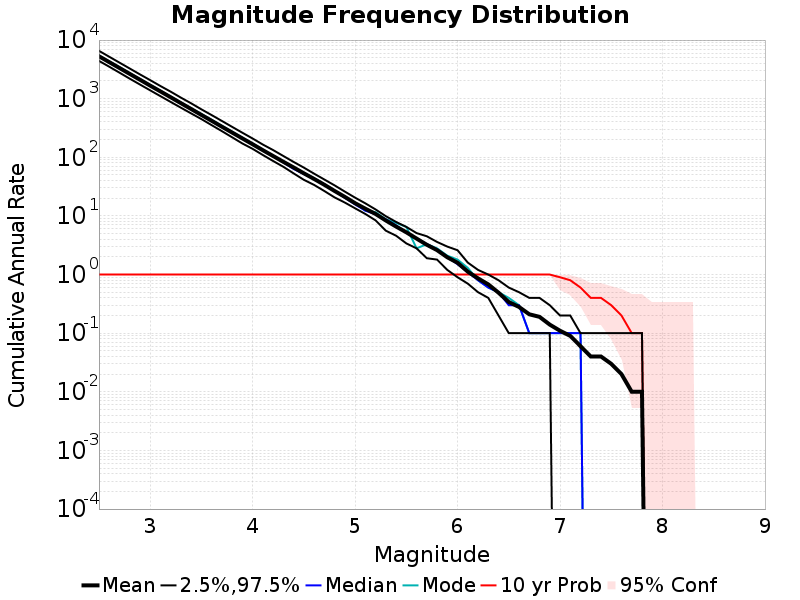
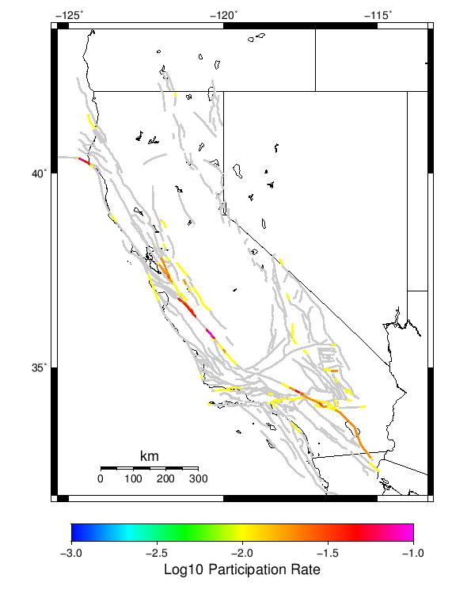
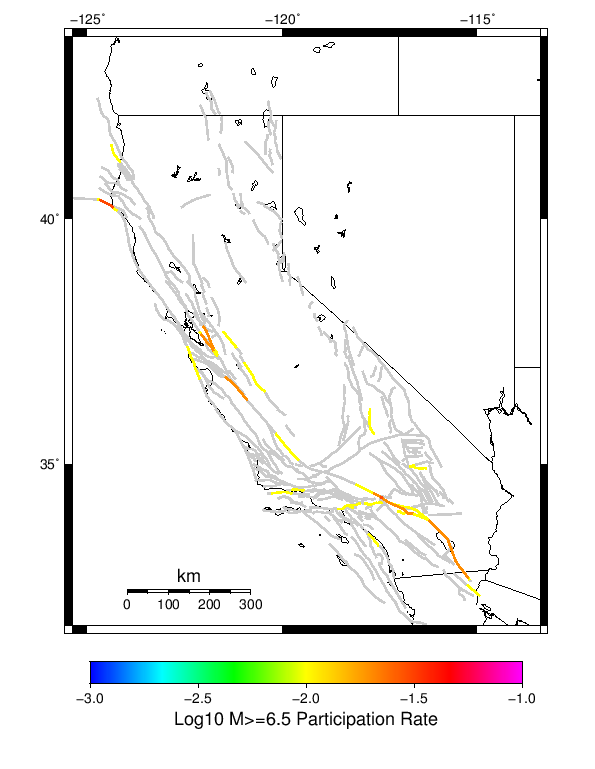
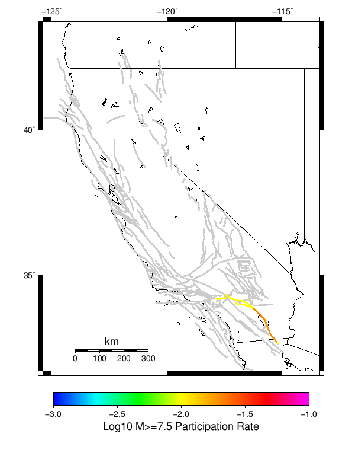
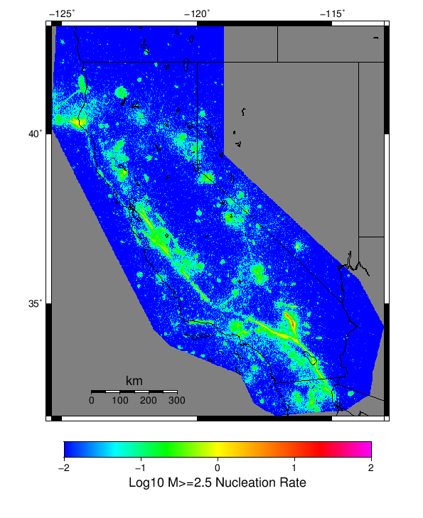
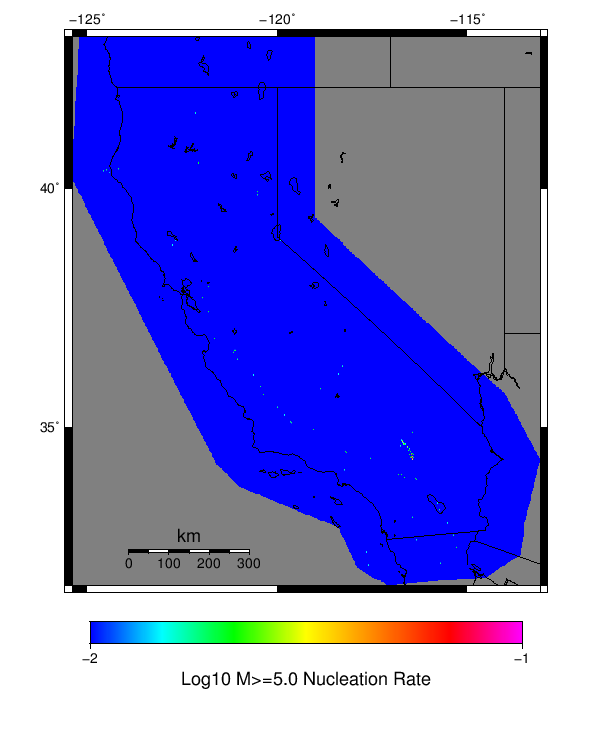

# Spontaneous/Historical ETAS Simulation Results

|   | Spontaneous/Historical ETAS Simulation |
|-----|-----|
| Num Simulations | 10 |
| Start Time | 1992/06/28 11:57:35 UTC |
| Start Time Epoch Milliseconds | 709732655000 |
| Duration | 10 Years |
| Includes Spontaneous? | true |
| Trigger Ruptures | *(none)* |
| Historical Ruptures | 220 Trigger Ruptures |
|   | First: M7.6 at 1872/03/26 10:31:39 UTC |
|   | Last: M7.28 at 1992/06/28 11:57:34 UTC |
|   | Largest: M7.8 at 1906/04/18 13:12:21 UTC |

## Table Of Contents

* [Magnitude Frequency Distribution](#magnitude-frequency-distribution)
* [Section Participation](#section-participation)
  * [Section Participation Plots](#section-participation-plots)
  * [Supra-Seismogenic Parent Sections Table](#supra-seismogenic-parent-sections-table)
  * [M≥6.5 Parent Sections Table](#m65-parent-sections-table)
  * [M≥7 Parent Sections Table](#m7-parent-sections-table)
  * [M≥7.5 Parent Sections Table](#m75-parent-sections-table)
* [Gridded Nucleation](#gridded-nucleation)
* [JSON Input File](#json-input-file)

## Magnitude Frequency Distribution
*[(top)](#table-of-contents)*

**Legend**
* **Mean** (thick black line): mean annual rate across all 10 catalogs
* **2.5%,97.5%** (thin black lines): annual rate percentiles across all 10 catalogs
* **Median** (thin blue line): median annual rate across all 10 catalogs
* **Mode** (thin cyan line): modal annual rate across all 10 catalogs (scaled to annualized value)
* **10 yr Probability** (thin red line): 10 year probability calculated as the fraction of catalogs with at least 1 occurrence
* **95% Conf** (light red shaded region): binomial 95% confidence bounds on probability



| Mag | Mean | 2.5 %ile | 97.5 %ile | Median | Mode | 10 yr Probability |
|-----|-----|-----|-----|-----|-----|-----|
| **M&ge;2.5** | 5294.400 | 4417.000 | 6555.000 | 5294.000 | 5432.800 | 1.000 |
| **M&ge;2.6** | 4207.340 | 3515.200 | 5197.700 | 4207.800 | 4325.600 | 1.000 |
| **M&ge;2.7** | 3342.980 | 2781.800 | 4124.800 | 3344.600 | 3436.400 | 1.000 |
| **M&ge;2.8** | 2651.820 | 2196.900 | 3275.400 | 2649.600 | 2721.700 | 1.000 |
| **M&ge;2.9** | 2107.780 | 1746.200 | 2597.800 | 2105.300 | 2160.100 | 1.000 |
| **M&ge;3** | 1671.270 | 1387.800 | 2072.900 | 1662.700 | 1715.700 | 1.000 |
| **M&ge;3.1** | 1331.160 | 1104.800 | 1644.600 | 1326.500 | 1366.000 | 1.000 |
| **M&ge;3.2** | 1058.000 | 880.400 | 1317.800 | 1055.100 | 1087.300 | 1.000 |
| **M&ge;3.3** | 838.600 | 701.800 | 1042.000 | 837.200 | 862.400 | 1.000 |
| **M&ge;3.4** | 666.530 | 560.700 | 833.200 | 668.400 | 684.700 | 1.000 |
| **M&ge;3.5** | 528.370 | 448.700 | 657.900 | 529.600 | 547.500 | 1.000 |
| **M&ge;3.6** | 419.770 | 353.700 | 525.100 | 416.000 | 434.500 | 1.000 |
| **M&ge;3.7** | 332.770 | 279.500 | 416.900 | 330.000 | 344.500 | 1.000 |
| **M&ge;3.8** | 264.290 | 219.400 | 330.500 | 266.200 | 273.500 | 1.000 |
| **M&ge;3.9** | 210.040 | 172.100 | 262.400 | 212.400 | 215.500 | 1.000 |
| **M&ge;4** | 167.020 | 139.400 | 209.200 | 169.900 | 171.100 | 1.000 |
| **M&ge;4.1** | 132.100 | 109.400 | 164.900 | 133.500 | 134.000 | 1.000 |
| **M&ge;4.2** | 105.240 | 86.500 | 132.900 | 104.700 | 105.300 | 1.000 |
| **M&ge;4.3** | 83.770 | 68.900 | 105.200 | 81.600 | 83.800 | 1.000 |
| **M&ge;4.4** | 67.110 | 53.200 | 83.400 | 63.300 | 67.800 | 1.000 |
| **M&ge;4.5** | 53.320 | 41.300 | 66.700 | 51.900 | 53.900 | 1.000 |
| **M&ge;4.6** | 42.750 | 33.800 | 52.600 | 42.900 | 44.000 | 1.000 |
| **M&ge;4.7** | 33.990 | 26.600 | 41.800 | 33.800 | 34.700 | 1.000 |
| **M&ge;4.8** | 26.650 | 20.700 | 33.200 | 26.700 | 26.700 | 1.000 |
| **M&ge;4.9** | 21.110 | 16.900 | 26.000 | 20.400 | 20.600 | 1.000 |
| **M&ge;5** | 16.500 | 13.500 | 20.500 | 15.700 | 16.500 | 1.000 |
| **M&ge;5.1** | 13.290 | 10.800 | 16.400 | 12.300 | 12.300 | 1.000 |
| **M&ge;5.2** | 10.800 | 8.400 | 12.900 | 10.700 | 11.600 | 1.000 |
| **M&ge;5.3** | 8.360 | 5.600 | 9.900 | 8.700 | 8.800 | 1.000 |
| **M&ge;5.4** | 6.590 | 4.600 | 7.900 | 6.900 | 7.600 | 1.000 |
| **M&ge;5.5** | 5.260 | 3.400 | 6.500 | 5.200 | 6.500 | 1.000 |
| **M&ge;5.6** | 4.110 | 2.800 | 5.100 | 4.100 | 2.800 | 1.000 |
| **M&ge;5.7** | 3.220 | 1.900 | 4.500 | 3.300 | 3.300 | 1.000 |
| **M&ge;5.8** | 2.610 | 1.800 | 3.600 | 2.700 | 2.800 | 1.000 |
| **M&ge;5.9** | 1.970 | 1.200 | 3.000 | 2.000 | 2.100 | 1.000 |
| **M&ge;6** | 1.590 | 0.900 | 2.600 | 1.500 | 1.800 | 1.000 |
| **M&ge;6.1** | 1.120 | 0.700 | 1.600 | 1.100 | 1.300 | 1.000 |
| **M&ge;6.2** | 0.860 | 0.500 | 1.200 | 0.800 | 0.800 | 1.000 |
| **M&ge;6.3** | 0.680 | 0.400 | 1.000 | 0.600 | 0.600 | 1.000 |
| **M&ge;6.4** | 0.490 | 0.200 | 0.800 | 0.500 | 0.500 | 1.000 |
| **M&ge;6.5** | 0.340 | 0.100 | 0.600 | 0.300 | 0.400 | 1.000 |
| **M&ge;6.6** | 0.280 | 0.100 | 0.500 | 0.300 | 0.300 | 1.000 |
| **M&ge;6.7** | 0.210 | 0.100 | 0.400 | 0.100 | 0.100 | 1.000 |
| **M&ge;6.8** | 0.190 | 0.100 | 0.400 | 0.100 | 0.100 | 1.000 |
| **M&ge;6.9** | 0.140 | 0.100 | 0.300 | 0.100 | 0.100 | 1.000 |
| **M&ge;7** | 0.110 | 0.000 | 0.200 | 0.100 | 0.100 | 0.900 |
| **M&ge;7.1** | 0.090 | 0.000 | 0.200 | 0.100 | 0.100 | 0.800 |
| **M&ge;7.2** | 0.060 | 0.000 | 0.100 | 0.100 | 0.100 | 0.600 |
| **M&ge;7.3** | 0.040 | 0.000 | 0.100 | 0.000 | 0.000 | 0.400 |
| **M&ge;7.4** | 0.040 | 0.000 | 0.100 | 0.000 | 0.000 | 0.400 |
| **M&ge;7.5** | 0.030 | 0.000 | 0.100 | 0.000 | 0.000 | 0.300 |
| **M&ge;7.6** | 0.020 | 0.000 | 0.100 | 0.000 | 0.000 | 0.200 |
| **M&ge;7.7** | 0.010 | 0.000 | 0.100 | 0.000 | 0.000 | 0.100 |
| **M&ge;7.8** | 0.010 | 0.000 | 0.100 | 0.000 | 0.000 | 0.100 |
| **M&ge;7.9** | 0.000 | 0.000 | 0.000 | 0.000 | 0.000 | 0.000 |
| **M&ge;8** | 0.000 | 0.000 | 0.000 | 0.000 | 0.000 | 0.000 |
| **M&ge;8.1** | 0.000 | 0.000 | 0.000 | 0.000 | 0.000 | 0.000 |
| **M&ge;8.2** | 0.000 | 0.000 | 0.000 | 0.000 | 0.000 | 0.000 |
| **M&ge;8.3** | 0.000 | 0.000 | 0.000 | 0.000 | 0.000 | 0.000 |
| **M&ge;8.4** | 0.000 | 0.000 | 0.000 | 0.000 | 0.000 | 0.000 |
| **M&ge;8.5** | 0.000 | 0.000 | 0.000 | 0.000 | 0.000 | 0.000 |
| **M&ge;8.6** | 0.000 | 0.000 | 0.000 | 0.000 | 0.000 | 0.000 |
| **M&ge;8.7** | 0.000 | 0.000 | 0.000 | 0.000 | 0.000 | 0.000 |
| **M&ge;8.8** | 0.000 | 0.000 | 0.000 | 0.000 | 0.000 | 0.000 |
| **M&ge;8.9** | 0.000 | 0.000 | 0.000 | 0.000 | 0.000 | 0.000 |
| **M&ge;9** | 0.000 | 0.000 | 0.000 | 0.000 | 0.000 | 0.000 |

## Section Participation
*[(top)](#table-of-contents)*

### Section Participation Plots
*[(top)](#table-of-contents)*

| Min Mag | Complete Catalog (including spontaneous) |
|-----|-----|
| **All Supra. Seis.** |  |
| **M&ge;6.5** |  |
| **M&ge;7** |  |
| **M&ge;7.5** |  |

### Supra-Seismogenic Parent Sections Table
*[(top)](#table-of-contents)*

*First 10 of 65 with matching ruptures shown*

| Parent Name | Total Mean Annual Rate | Total 10 Year Prob |
|-----|-----|-----|
| Mendocino | 0.11 | 0.6 |
| San Andreas (Parkfield) | 0.09 | 0.7 |
| San Andreas (Creeping Section) 2011 CFM | 0.07 | 0.6 |
| San Andreas (Mojave S) | 0.06 | 0.4 |
| Calaveras (Central) 2011 CFM | 0.03 | 0.3 |
| Calaveras (So) - Paicines extension 2011 CFM | 0.03 | 0.3 |
| Hayward (So) extension 2011 CFM | 0.03 | 0.2 |
| Ortigalita (North) | 0.03 | 0.2 |
| San Andreas (San Bernardino N) | 0.03 | 0.3 |
| San Andreas (San Bernardino S) | 0.03 | 0.3 |

### M≥6.5 Parent Sections Table
*[(top)](#table-of-contents)*

*First 10 of 40 with matching ruptures shown*

| Parent Name | Total Mean Annual Rate | Total 10 Year Prob |
|-----|-----|-----|
| Mendocino | 0.03 | 0.3 |
| San Andreas (San Bernardino N) | 0.03 | 0.3 |
| Brawley (Seismic Zone) alt 1 | 0.02 | 0.2 |
| Calaveras (Central) 2011 CFM | 0.02 | 0.2 |
| Calaveras (No) 2011 CFM | 0.02 | 0.2 |
| Hayward (So) 2011 CFM | 0.02 | 0.2 |
| Hayward (So) extension 2011 CFM | 0.02 | 0.2 |
| Imperial | 0.02 | 0.2 |
| San Andreas (Coachella) rev | 0.02 | 0.2 |
| San Andreas (Creeping Section) 2011 CFM | 0.02 | 0.2 |

### M≥7 Parent Sections Table
*[(top)](#table-of-contents)*

*First 10 of 25 with matching ruptures shown*

| Parent Name | Total Mean Annual Rate | Total 10 Year Prob |
|-----|-----|-----|
| Brawley (Seismic Zone) alt 1 | 0.02 | 0.2 |
| Imperial | 0.02 | 0.2 |
| San Andreas (Coachella) rev | 0.02 | 0.2 |
| San Andreas (San Bernardino N) | 0.02 | 0.2 |
| San Andreas (San Gorgonio Pass-Garnet HIll) | 0.02 | 0.2 |
| Airport Lake | 0.01 | 0.1 |
| Cucamonga | 0.01 | 0.1 |
| Elysian Park (Upper) | 0.01 | 0.1 |
| Hollywood | 0.01 | 0.1 |
| Little Lake | 0.01 | 0.1 |

### M≥7.5 Parent Sections Table
*[(top)](#table-of-contents)*

| Parent Name | Total Mean Annual Rate | Total 10 Year Prob |
|-----|-----|-----|
| Brawley (Seismic Zone) alt 1 | 0.02 | 0.2 |
| Imperial | 0.02 | 0.2 |
| San Andreas (Coachella) rev | 0.02 | 0.2 |
| Cucamonga | 0.01 | 0.1 |
| San Andreas (North Branch Mill Creek) | 0.01 | 0.1 |
| San Andreas (San Bernardino N) | 0.01 | 0.1 |
| San Andreas (San Gorgonio Pass-Garnet HIll) | 0.01 | 0.1 |
| San Gorgonio Pass | 0.01 | 0.1 |
| Sierra Madre | 0.01 | 0.1 |
## Gridded Nucleation
*[(top)](#table-of-contents)*

| Min Mag | Complete Catalog (including spontaneous) |
|-----|-----|
| **M&ge;2.5** |  |
| **M&ge;5** |  |
| **M&ge;6** |  |
| **M&ge;7** |  |

## JSON Input File
*[(top)](#table-of-contents)*

```
{
  "numSimulations": 10,
  "duration": 10.0,
  "startTimeMillis": 709732655000,
  "includeSpontaneous": true,
  "binaryOutput": true,
  "binaryOutputFilters": [
    {
      "prefix": "results_complete",
      "descendantsOnly": false
    },
    {
      "prefix": "results_m5_preserve_chain",
      "minMag": 5.0,
      "preserveChainBelowMag": true,
      "descendantsOnly": false
    }
  ],
  "forceRecalc": false,
  "simulationName": "Spontaneous/Historical ETAS Simulation",
  "numRetries": 3,
  "outputDir": "/tmp/etas_debug/output",
  "triggerCatalog": "$ETAS_LAUNCHER/inputs/u3_historical_catalog.txt",
  "triggerCatalogSurfaceMappings": "$ETAS_LAUNCHER/inputs/u3_historical_catalog_finite_fault_mappings.xml",
  "cacheDir": "$ETAS_LAUNCHER/inputs/cache_fm3p1_ba",
  "fssFile": "$ETAS_LAUNCHER/inputs/2013_05_10-ucerf3p3-production-10runs_COMPOUND_SOL_FM3_1_SpatSeisU3_MEAN_BRANCH_AVG_SOL.zip",
  "probModel": "FULL_TD",
  "applySubSeisForSupraNucl": true,
  "totRateScaleFactor": 1.14,
  "gridSeisCorr": true,
  "timeIndependentERF": false,
  "griddedOnly": false,
  "imposeGR": false,
  "includeIndirectTriggering": true,
  "gridSeisDiscr": 0.1
}
```

